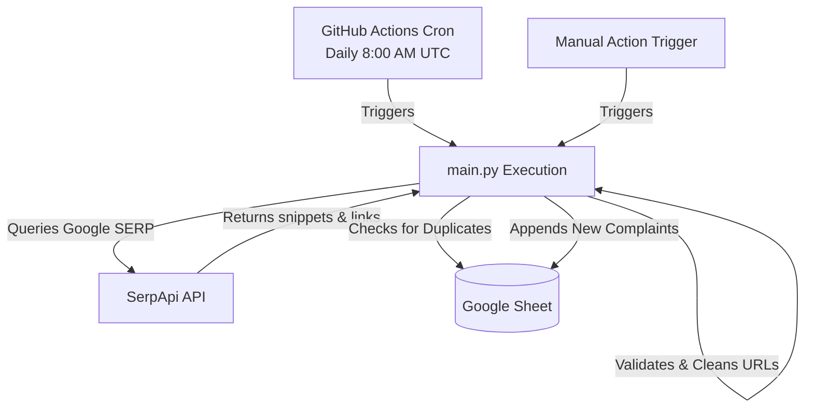

# 🚀 Automated X (Twitter) Problem Scraper & Google Sheet Logger

An automated, serverless Python pipeline that extracts target customer pain points from X (formerly Twitter) via Google Search results (using **SerpApi**) and logs them directly into a **Google Sheet** for human triage and review.

The pipeline is fully automated using **GitHub Actions** to run once a day, and includes a smart deduplication mechanism to ensure no single complaint is logged twice.

---

## 🏛️ System Architecture



---

## 🛠️ Tech Stack & Requirements
* **Language:** Python 3.9+
* **Scraping Engine:** SerpApi (Google Search Engine)
* **Storage & Integration:** `gspread` & `google-auth` (Google Sheets API)
* **Automation Platform:** GitHub Actions (cron scheduling & secure secrets management)

---

## 🚀 Setup & Installation

### Step 1: Obtain a SerpApi Key
1. Go to [SerpApi](https://serpapi.com/) and register for a free account.
2. The free tier provides **100 searches/month**, which is plenty for daily automated sweeps.
3. Locate your API key on your dashboard (we will use this as `SERPAPI_KEY` later).

---

### Step 2: Configure Google Cloud & Service Account
To allow the Python script to write to your Google Sheet without prompt screens or user logins, you must configure a Google Service Account:

1. **Go to GCP Console**: Navigate to the [Google Cloud Console](https://console.cloud.google.com/).
2. **Create Project**: Click on the project dropdown, choose **New Project**, name it (e.g. `X-Scraper-Logger`), and click **Create**.
3. **Enable APIs**:
   * Search for **Google Sheets API** in the search bar at the top, click it, and click **Enable**.
   * Search for **Google Drive API** in the search bar, click it, and click **Enable**.
4. **Create Service Account**:
   * Go to **IAM & Admin** > **Service Accounts**.
   * Click **Create Service Account** at the top.
   * Provide a name (e.g., `sheet-logger-service-account`), and click **Create and Continue**.
   * Skip optional role configurations and click **Done**.
5. **Create & Download Key**:
   * In the Service Accounts list, click on your newly created service account email.
   * Navigate to the **Keys** tab.
   * Click **Add Key** > **Create new key**.
   * Select **JSON** as the key type and click **Create**.
   * Save the downloaded `.json` credentials file securely. This entire JSON structure will be your `GCP_SERVICE_ACCOUNT_JSON` secret.
6. **Note the Service Account Email**:
   * Note the service account email (usually looks like `sheet-logger-service-account@<project-id>.iam.gserviceaccount.com`). You will need this in the next step.

---

### Step 3: Setup the Google Sheet
1. Create a new Google Sheet or open an existing one.
2. **Extract Sheet ID**: Look at the spreadsheet URL. Copy the long random string of letters and numbers between `/d/` and `/edit` (e.g., `https://docs.google.com/spreadsheets/d/1A2B3C4D5E.../edit`). This is your `GOOGLE_SHEET_KEY`.
3. **Share Sheet with Service Account**:
   * Click the blue **Share** button in the top-right corner of your Google Sheet.
   * Paste the **Service Account email** (noted in Step 2.6) in the email field.
   * Make sure the role is set to **Editor**.
   * Uncheck "Notify people" and click **Share**.
4. **Columns Layout**:
   * The script automatically initializes headers on run if your worksheet is empty.
   * The sheet layout is structured as follows:
     * **Column A:** `Complaint Snippet` (the Google search text snippet outlining the user's SaaS complaint)
     * **Column B:** `X/Twitter URL` (the source link pointing to the complaint on X)
     * **Column C:** `Date Logged` (UTC timestamp when the pipeline wrote the row)

---

### Step 4: Configure GitHub Secrets
To run this pipeline daily in GitHub Actions, you must store your secret keys securely in GitHub:

1. On your GitHub repository page, click on **Settings** in the top navigation bar.
2. In the left sidebar, click **Secrets and variables** > **Actions**.
3. Under **Repository secrets**, click **New repository secret** for each of the following:

| Secret Name | Value |
| :--- | :--- |
| `SERPAPI_KEY` | Your SerpApi API Key (Step 1) |
| `GCP_SERVICE_ACCOUNT_JSON` | The entire content of your Google Cloud Service Account JSON file (Step 2.5) |
| `GOOGLE_SHEET_KEY` | Your Google Spreadsheet ID / Key (Step 3.2) |

---

## 💻 Local Execution & Testing

You can run the script locally to verify configurations or test search queries before deploying it to GitHub Actions.

### 1. Install dependencies
```bash
pip install -r requirements.txt
```

### 2. Verify with Dry-Run Mode
Setting `DRY_RUN=true` will bypass live calls to SerpApi and Google Sheets, simulating the pipeline workflow using pre-packaged mock data. This is perfect for verifying the environment is set up properly.

* **On Windows (PowerShell):**
  ```powershell
  $env:DRY_RUN="true"
  python main.py
  ```
* **On macOS / Linux:**
  ```bash
  DRY_RUN=true python main.py
  ```

### 3. Run Production Scrape Locally
To run a live scrape and update your Google Sheet from your local machine, export the required credentials to your environment:

* **On Windows (PowerShell):**
  ```powershell
  $env:SERPAPI_KEY="your_serpapi_key"
  $env:GCP_SERVICE_ACCOUNT_JSON='{"type": "service_account", ...}'
  $env:GOOGLE_SHEET_KEY="your_google_sheet_id"
  python main.py
  ```
* **On macOS / Linux:**
  ```bash
  export SERPAPI_KEY="your_serpapi_key"
  export GCP_SERVICE_ACCOUNT_JSON='{"type": "service_account", ...}'
  export GOOGLE_SHEET_KEY="your_google_sheet_id"
  python main.py
  ```

---

## 🤖 GitHub Automation Workflow
The daily automation is managed by `.github/workflows/daily_scrape.yml`. 
* **Schedule:** Runs every day at **8:00 AM UTC** (`0 8 * * *`).
* **Manual Dispatch:** Can be manually triggered at any time by navigating to your repository's **Actions** tab, selecting **Daily X Problem Scraper** in the sidebar, and clicking **Run workflow**.
