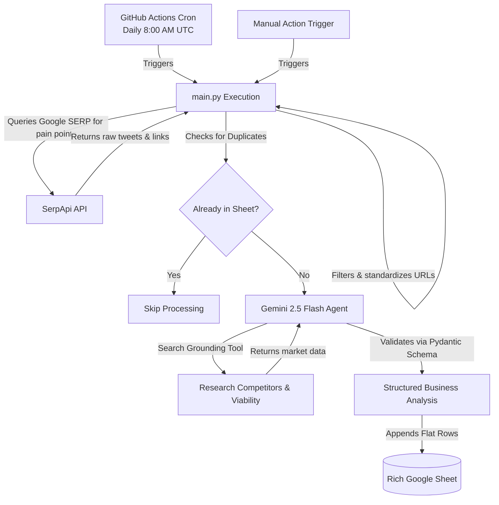

# 🚀 Autonomous AI-Driven SaaS Ideation & Research Pipeline

An autonomous, serverless pipeline that extracts target customer pain points from X (formerly Twitter) via Google Search results, evaluates them through an advanced **Gemini AI Business Agent** with real-time **Google Search Grounding**, and outputs ready-to-build, validated business concepts directly into a structured **Google Sheet**.

This pipeline is fully scheduled to run daily at 8:00 AM UTC via **GitHub Actions** and uses a smart deduplication mechanism to ensure no single complaint is processed or logged twice.

---

## 🏛️ System Architecture & Workflow



---

## 📊 Google Sheets Layout

The pipeline outputs structured rows mapping to these exact 12 columns:

1. **Timestamp:** Date and time of analysis (UTC).
2. **Raw Tweet:** The original tweet text summarizing the complaint.
3. **X URL:** Clickable link pointing directly to the source post on X.
4. **Feasibility (1-10):** AI-assessed doability of solving this in the modern world.
5. **Rationale:** A 2-sentence breakdown of the technical or market friction.
6. **Product Name:** A creative, catchy proposed name for the SaaS solution.
7. **Product Concept:** A clear one-liner summary of the SaaS product concept.
8. **Core Features:** A comma-separated list of top 3 MVP features.
9. **Tech Stack:** Recommended tech stack to build the MVP (e.g. React, Firebase, OpenAI API).
10. **Competitors:** Existing players and products operating in the space.
11. **Unfair Moat:** An analysis of how this concept differentiates and wins against incumbents.
12. **Target Audience:** The specific professional archetype / target market willing to pay.

---

## 🛠️ Setup & Installation

### Step 1: Obtain a SerpApi Key
1. Register for an account at [SerpApi.com](https://serpapi.com/).
2. Grab your API Key from the dashboard (we'll save this as `SERPAPI_KEY`).

---

### Step 2: Get a Gemini API Key
1. Go to [Google AI Studio](https://aistudio.google.com/).
2. Sign in and click **Create API Key**.
3. Copy your API Key (we'll save this as `GEMINI_API_KEY`).

---

### Step 3: Configure Google Cloud & Service Account
To allow the Python script to write to your Google Sheet without prompt screens or user logins:

1. **Open GCP Console**: Go to the [Google Cloud Console](https://console.cloud.google.com/).
2. **Create Project**: Click the project dropdown, choose **New Project**, name it `SaaS-Incubator`, and click **Create**.
3. **Enable APIs**:
   * Search for **Google Sheets API** in the top search bar and click **Enable**.
   * Search for **Google Drive API** in the top search bar and click **Enable**.
4. **Create Service Account**:
   * Navigate to **IAM & Admin** > **Service Accounts**.
   * Click **Create Service Account** at the top.
   * Name it `sheets-logger` and click **Create and Continue**, then click **Done**.
5. **Generate JSON Key**:
   * In the Service Accounts list, click on the email of the service account you just created.
   * Go to the **Keys** tab at the top.
   * Click **Add Key** > **Create new key**.
   * Select **JSON** and click **Create**. A `.json` file containing your credentials will download.
   * Open this file in any text editor, select all, and copy it. This is your `GCP_SERVICE_ACCOUNT_JSON`.
6. **Share your Sheet**:
   * Copy the email address of the service account you created.
   * Open your Google Sheet, click **Share** in the top right.
   * Paste the service account email, set the role to **Editor**, and click **Share**.

---

### Step 4: Extract Google Sheet Key
Look at the URL of your Google Sheet. Copy the long random string of letters and numbers between `/d/` and `/edit`. This is your `GOOGLE_SHEET_KEY`.

---

### Step 5: Configure GitHub Secrets
Go to your repository settings page on GitHub, click **Secrets and variables** > **Actions**, and create four **Repository secrets**:

| Secret Name | Value |
| :--- | :--- |
| `SERPAPI_KEY` | Your SerpApi API Key (Step 1) |
| `GEMINI_API_KEY` | Your Google Gemini API Key (Step 2) |
| `GCP_SERVICE_ACCOUNT_JSON` | The complete raw JSON string from your Service Account key file (Step 3.5) |
| `GOOGLE_SHEET_KEY` | Your Google Spreadsheet ID / Key (Step 4) |

---

## 💻 Local Testing & Verification

### 1. Install dependencies
```bash
pip install -r requirements.txt
```

### 2. Verify with Dry-Run Mode
Setting `DRY_RUN=true` will bypass live API calls to SerpApi, Gemini, and Google Sheets, simulating the pipeline workflow using pre-packaged mock data and matching Pydantic formats.

* **On Windows (PowerShell):**
  ```powershell
  $env:DRY_RUN="true"
  python main.py
  ```
* **On macOS / Linux:**
  ```bash
  DRY_RUN=true python main.py
  ```

### 3. Run Production Scrape Locally
To run a live scrape and update your Google Sheet from your local machine, export the required credentials to your environment:

* **On Windows (PowerShell):**
  ```powershell
  $env:SERPAPI_KEY="your_serpapi_key"
  $env:GEMINI_API_KEY="your_gemini_api_key"
  $env:GCP_SERVICE_ACCOUNT_JSON='{"type": "service_account", ...}'
  $env:GOOGLE_SHEET_KEY="your_google_sheet_id"
  python main.py
  ```
* **On macOS / Linux:**
  ```bash
  export SERPAPI_KEY="your_serpapi_key"
  export GEMINI_API_KEY="your_gemini_api_key"
  export GCP_SERVICE_ACCOUNT_JSON='{"type": "service_account", ...}'
  export GOOGLE_SHEET_KEY="your_google_sheet_id"
  python main.py
  ```
